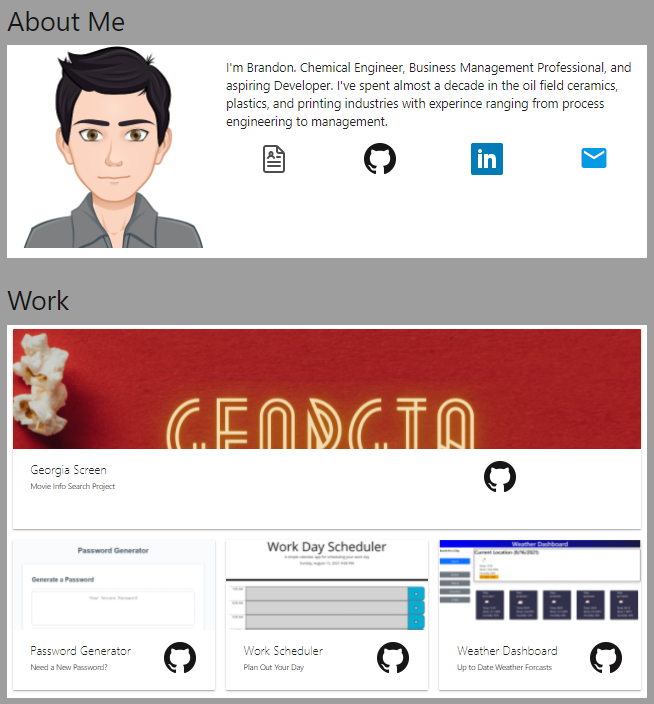

# CodingPortfolio
GTPE Coding Bootcamp Homework 2 : Single Page Portfolio

### About
This project is a protfolio to showcase previous development work.
As part of the course work for the GTPE Coding Bootcamp, this project uses HTML and CSS to create a portfolio page, with a responsive layout, as a way to showcase current and future work.

Showcased on this page is an "About Me" section with an avitar and a breif discription, a work section including 2 active links to projects and two placeholder images for future work, and finally a contact info section with place holders for email, linkedin, and phone number. Real contact info was withheld on purpose until I decide what information I want made public.

### **Update 08/16/2021**
Changes:
* Updated styling using materialize in place of the previous standalone CSS.
* Added in icons with links to Linkedin, Github, and Email.  Depricated contact section
* Added in 4 current projects and improved responsiveness

### Link
[Developer Portfolio](https://berlicthehunter.github.io/CodingPortfolio/)

### Screen Shot

